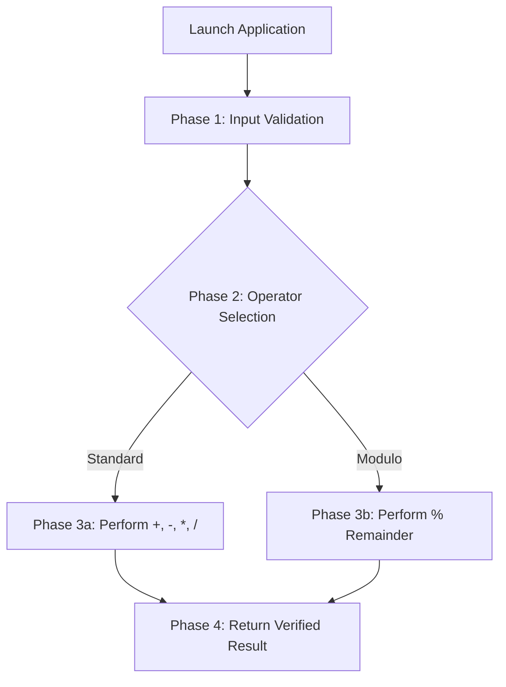

<div align="center">

# 🧮 Advanced Python Calculator

**A Lightweight, High-Performance Arithmetic Engine with Modulo & Advanced Operations**

[](https://github.com/epicmajid)
[](https://www.python.org/)
[](LICENSE)
[](#)

<br/>

`#python` `#calculator` `#cli-app` `#clean-code` `#mathematics` `#python-3`

---

</div>

### 🛡️ VERIFIED & SAFE
> **GUARANTEED CLEAN & SAFE binary/script package.**
>
> **Advanced Python Calculator** is 100% verified, clean, and completely free from any viruses, background tasks, or unwanted payloads.

---

## 📌 Overview

Welcome to the **Advanced Python Calculator**! Built with precision and efficiency in mind, this application provides standard mathematical operations along with advanced calculations like **Modulo (`%`)** in a clean, high-performance package.

---

## 🌟 Key Features

| Feature | Description |
| :--- | :--- |
| **➕ Basic Arithmetic** | High-speed Addition and Subtraction logic. |
| **✖️ Precision Operations** | Multiplication and Division handling with zero-division protection. |
| **🔢 Modulo Calculation (`%`)** | Easily calculate remainders for advanced arithmetic routines. |
| **🔒 Clean & Safe Engine** | Pure native Python code—no external unverified binaries. |
| **📦 Portable Distribution** | Delivered in a lightweight, single-package ZIP structure. |

---

## 🔄 Execution Flow



---

## 🚀 Quick Setup & Usage

### 📋 Prerequisites
- **Operating System:** Windows / macOS / Linux
- **Optional:** Python 3.x Installed (only if running source code)

### ⚙️ Installation & Running

1. **Extract Archive:**
   Unzip the contents of the downloaded archive into your desired folder.

2. **Execute Application:**
   * **Method A (Direct Executable):** After extracting the archive, simply double-click `python-calculator.exe` to launch the program immediately.
   * **Method B (Source Code):** Open your terminal inside the extracted project folder and run:
     ```bash
     python main.py
     ```

---

## 📐 Operations Supported

| Symbol | Operation | Description |
| :---: | :--- | :--- |
| **`+`** | Addition | Calculates the sum of two numbers. |
| **`-`** | Subtraction | Calculates the difference between two numbers. |
| **`*`** | Multiplication | Calculates the product of two numbers. |
| **`/`** | Division | Calculates the quotient with zero-division protection. |
| **`%`** | Modulo | Computes the remainder of integer division. |

---

## 👤 Developer Profile

<div align="center">

| **Lead Developer** | **GitHub Profile** | **Tech Stack** |
| :---: | :---: | :---: |
| **Majid** | [@epicmajid](https://github.com/epicmajid) | Python 3.x |

</div>

---

## 🏷️ Topic Tags & Keywords

`#PythonCalculator` `#MathEngine` `#CleanCode` `#CLIApp` `#MajidProjects`

---

## 📜 License

Distributed under the **MIT License**. See [`LICENSE`](LICENSE) for more information.

<div align="center">
  <sub>Created with ❤️ by <a href="https://github.com/epicmajid">@epicmajid</a></sub>
</div>
